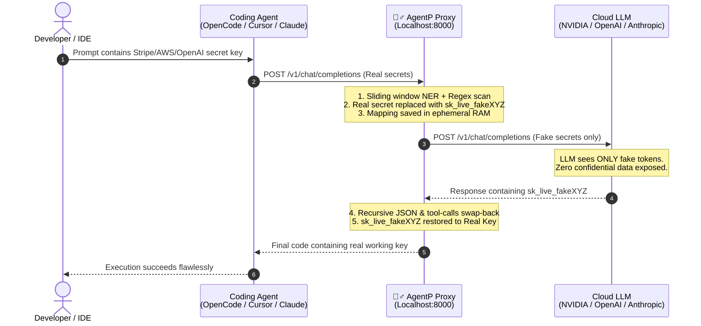

<p align="center">
  
</p>

<h1 align="center">@tamgallc/agentp</h1>

<p align="center">
  <b>Local PII Redaction & Fake-Swap Privacy Shield for AI Coding Agents</b><br>
  <i>Native Zero-Configuration Support for OpenCode • Claude Code • Cursor • Antigravity</i>
</p>

<p align="center">
  <a href="https://www.npmjs.com/package/@tamgallc/agentp"></a>
  <a href="https://www.npmjs.com/package/@tamgallc/agentp"></a>
  
  
  = 18">
</p>

<p align="center">
  
</p>

---

## 🕵️‍♂️ Overview

**AgentP** (O.W.C.A. Top Secret Privacy Shield) is a high-performance, local reverse proxy that protects sensitive secrets, API keys, and PII from ever leaving your machine when interacting with cloud LLMs.

Modern AI coding agents (such as **OpenCode**, **Claude Code**, **Cursor**, and **Antigravity**) frequently inspect your workspace, `.env` files, and terminal logs. If prompt context contains database passwords, private keys, or API tokens, they get broadcast to upstream model providers.

AgentP solves this with **Bi-Directional Fake-Swapping**:
1. **Outgoing Prompt Interception**: Before requests leave your computer, AgentP scans prompts using an on-device HuggingFace NER model combined with deterministic regex rules.
2. **Syntactic Fake Insertion**: Real secrets are replaced with realistic dummy tokens (`sk_live_fake...`, `sk-ant-fake...`) preserving exact key syntax and prefixes.
3. **Consistent State Cache**: If an API key appears multiple times across turns or roles (`system`, `user`, `assistant`, `tool`), the exact same fake key is reused.
4. **Incoming Response Restoration**: When the upstream LLM returns code or tool calls containing the dummy tokens, AgentP swaps the real keys back in memory before handing the response to your agent.

---

## ⚡ Quick Start

### Option 1: Run instantly with `npx` (Zero Installation)

```bash
npx @tamgallc/agentp
```

### Option 2: Global CLI Installation

```bash
npm install -g @tamgallc/agentp
agentp
```

### Option 3: Python Package

```bash
git clone https://github.com/Uunan/agentp.git
cd agentp
pip install -r requirements.txt
pip install torch --index-url https://download.pytorch.org/whl/cu126  # Optional: for GPU acceleration

# Launch setup wizard & proxy:
agentp
```

---

## 🤖 1-Click Coding Agent Setup

AgentP includes automated configuration installers for all major AI coding agents across **Linux**, **macOS**, and **Windows**:

```bash
# Configure all agents in a single step:
agentp --install all

# Or configure specific agents:
agentp --install opencode     # OpenCode (~/.config/opencode/opencode.json)
agentp --install claude       # Claude Code (~/.claude/settings.json)
agentp --install cursor       # Cursor (User/settings.json)
agentp --install antigravity  # Antigravity (~/.gemini/antigravity-cli/settings.json)
```

### Supported Coding Agent Details:

| Agent | Target Config File | Configuration Applied |
| :--- | :--- | :--- |
| **OpenCode** | `~/.config/opencode/opencode.json` | Configures `agentp` provider using `@ai-sdk/openai-compatible` pointing to `http://127.0.0.1:8000/v1` |
| **Claude Code** | `~/.claude/settings.json` | Sets `env.ANTHROPIC_BASE_URL` to `http://127.0.0.1:8000` (uses `/v1/messages` Anthropic adapter) |
| **Cursor** | `AppData/Roaming/Cursor/User/settings.json` | Configures `cursor.openai.baseUrl` to `http://127.0.0.1:8000/v1` |
| **Antigravity** | `~/.gemini/antigravity-cli/settings.json` | Sets `openai_base_url` to `http://127.0.0.1:8000/v1` and injects `AGENTP_PROXY_URL` |

---

## 🛠️ How It Works (Architecture)



---

## 🔌 API Endpoints & Compatibility

AgentP acts as a drop-in proxy replacement for both OpenAI and Anthropic API specifications:

| Method | Endpoint | Description |
| :--- | :--- | :--- |
| `GET` | `/health` | Service health status and active NER model check |
| `GET` | `/v1/models` | OpenAI-compatible model discovery endpoint (for OpenCode and Cursor) |
| `POST` | `/v1/chat/completions` | Standard OpenAI chat completions endpoint (supports SSE streaming and tool calling) |
| `POST` | `/v1/messages` | Native Anthropic Messages API adapter (for Claude Code) |
| `POST` | `/v1/responses` | Responses-API proxy endpoint |
| `POST` | `/detect` | Standalone PII/Secret detection endpoint for verification and debugging |

---

## 💻 CLI Commands & Options

```bash
agentp                   # Starts proxy (opens interactive setup wizard on first run)
agentp --setup           # Launches the interactive configuration wizard
agentp --install all     # Configures OpenCode, Claude Code, Cursor, and Antigravity
agentp --port 8080       # Starts proxy on custom port
agentp --host 0.0.0.0    # Binds to custom host interface
agentp --check           # Runs local NER model smoke test
```

---

## 🔒 Security & Privacy Guarantees

- **100% On-Device Detection**: The HuggingFace token-classification model runs entirely on your local CPU or GPU. Prompts are never transmitted to third parties for PII analysis.
- **Strict Ephemeral RAM Mapping**: Real-to-fake translation dictionaries live strictly in memory and are discarded immediately when the request lifecycle ends. No sensitive values are written to disk, SQLite, or log files.
- **Sliding-Window Coverage**: Prompts and codeblocks of arbitrary length (including documents far exceeding 256 tokens) are scanned without truncation.
- **Deterministic Regex Fallback**: In addition to deep NER, specialized patterns catch naked API keys (Stripe, OpenAI, Anthropic, AWS, GitHub PATs, Slack, NVIDIA Cloud) with 100% deterministic precision.

---

## 📄 License & Credits

Built by **Tamga LLC** under the **Apache-2.0 License**.  
Special agent operations managed by **O.W.C.A. Division**.
